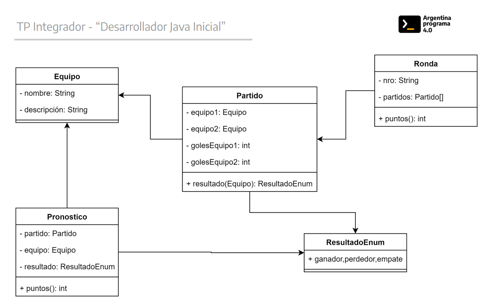
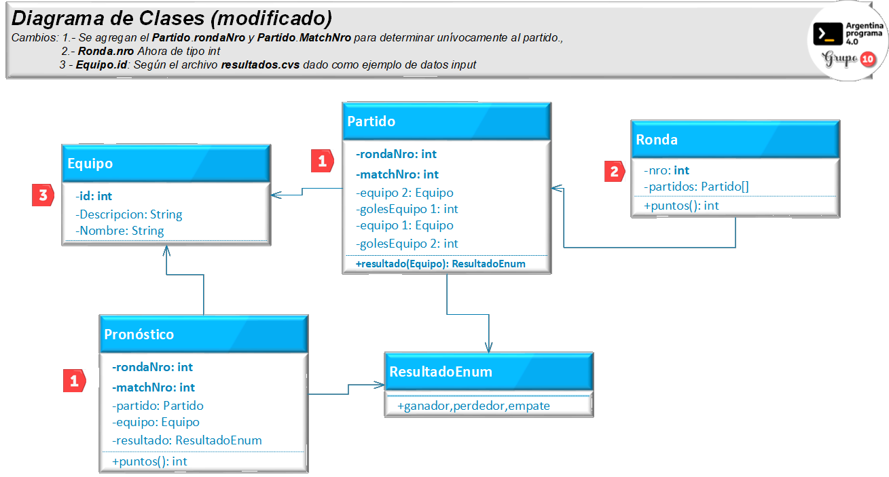
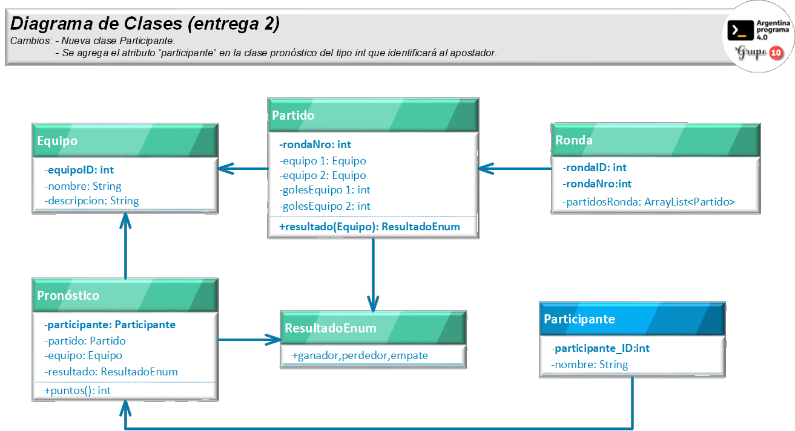
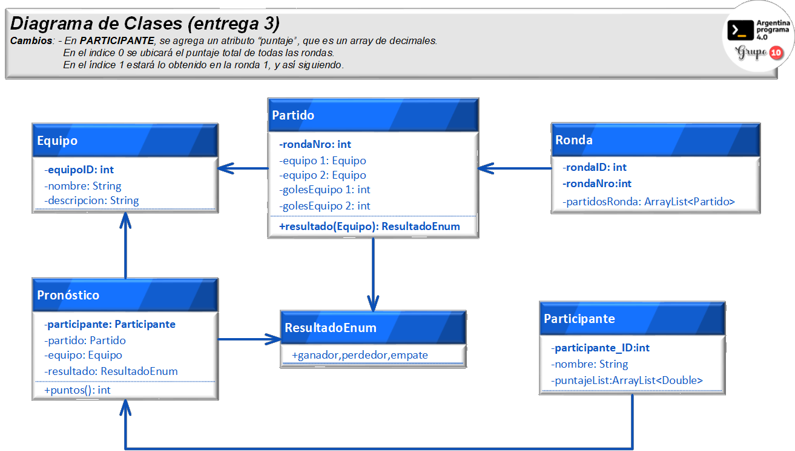

# __Pronósticos Deportivos__  -  ___Grupo 10/150___
##  ___Entrega 3___ (Bases de Datos) 

## __Datos de la Presentación__

<a name="top"></a>

#### Fecha Tercera Entrega: ...
>##### Integrantes por orden alfabético:
>* __`Guillermo Escobar`__
>* __`Norma Ramirez`__
>* __`Pablo Martin Torres`__
>* __`Juan Carlos Alderete`__

## Índice de contenidos

1. [Introducción](#item1)
2. [Entrega 1](#item2)
3. [Entrega 2](#item3)
4. [Entrega 3](#item4)

## **Comandos simples para ejecutar con maven**

### Crear archivo jar para maven:
```
mvn install
```

### Ejecutar desde root el proyecto maven:
```
mvn exec:java -Dexec.mainClass=com.grupo10_150.App
```

### Estructura del proyecto:
```
.
├── README.md
├── pom.xml
└── src
    └── main
        └── java
            ├── com\grupo10_150
            │   ├── Persona.java
            │   ├── Partido.java
            │   ├── PartidoTest.java
            │   ├── ControlBind.java
            │   ├── ResultadoEnum.java
            │   ├── LeerTablaParticipantes.java
            │   ├── LeerTablaPronostico.java
            │   ├── Ronda.java
            │   ├── Pronostico.java
            │   ├── PronosticoDB.java
            │   ├── Equipo.java
            │   ├── LectorControlCsv.java
            │   ├── Participante.java
            │   ├── ParticipanteDB.java
            │   ├── ResultadoBind.java
            │   ├── PronosticoBind.java
            │   ├── LectorCsv.java
            │   └── App.java
            ├── conexion\sql
            │   └── ConectorSQL.java
            └── resources
                └── control.csv
                └── resultados.csv

   
```

------

<a name="item1"></a>

[Subir](#top)

## Introducción
Nos han solicitado el desarrollo de un programa de Pronósticos Deportivos.
Un pronóstico deportivo consta de un posible resultado de un partido (que un equipo gane,
pierda o empate), propuesto por una persona que está participando de una competencia
contra otras.
Cada partido tendrá un resultado. Este resultado se utilizará para otorgar puntos a los
participantes de la competencia según el acierto de sus pronósticos.
Finalmente, quien gane la competencia será aquella persona que sume mayor cantidad de
puntos.
<br>
## Consigna
La propuesta del trabajo práctico consiste en implementar un programa de consola que dada
la información de resultados de partidos e información de pronósticos, ordene por puntaje
obtenido a los participantes.
<br>
## Alcance
En este trabajo práctico nos limitaremos a pronosticar los resultados de los partidos, sin
importar los goles ni la estructura del torneo (si es grupo, eliminatoria u otro); simplemente se
sumarán puntos y se obtendrá un listado final.
A continuación, se propone un diagrama de clases inicial que puede ser modificado en
cualquier momento
<br> <br>

# **Diagrama de Clases** 
<p align="center">
  
</p>

[Subir](#top)

<a name="item2"></a>

------
# __ENTREGA 1:__ 
A partir del esquema original propuesto, desarrollar un programa que lea un archivo de
partidos y otro de resultados, el primero correspondiente a una ronda y el otro que contenga
los pronósticos de una persona1. Cada ronda debe tener una cantidad fija de partidos.
<br> 

__Se considera una única ronda y un único participante en esta entrega__
<br><br>

# __Diagrama de Clases Aumentado__ 
<p align="center">
  
</p>

<a name="item3"></a>

[Subir](#top)

------
#  __ENTREGA 2__ 
En esta entrega se debe poder soportar que los archivos contengan información de muchas
rondas y de muchas personas (para eso hay que agregar los datos de ronda y persona en los
archivos correspondientes).
Por otro lado, al leer cada línea del archivo de resultados, se debe verificar que la misma sea
correcta: número correcto de campos y que la cantidad de goles sea un número entero. Cada
ronda puede tener cualquier cantidad de partidos.
Al finalizar el programa, se debe imprimir un listado de los puntajes de cada persona que
participa.
<br>
El programa debe:

- Utilizar la herramienta Maven y su estructura de proyecto. La misma debe estar implementada en el repositorio de GIT escogido.
- Imprimir por pantalla el nombre de cada persona, el puntaje total y la cantidad de pronósticos acertados.
- Implementar un test (al menos uno, pero se recomienda hacer más) que calcule el puntaje de una persona en 2 (dos) rondas consecutivas.

### Ejemplo:

#### Archivo resultados.csv:

| Ronda |    Equipo 1    | CantGoles1 | CantGoles2 |    Equipo 2    |
| :---: | :------------: | :--------: | :--------: | :------------: |
|   1   |   Argentina    |     1      |     2      | Arabia Saudita |
|   1   |    Polonia     |     0      |     0      |     México     |
|   1   |   Argentina    |     2      |     0      |     México     |
|   1   | Arabia Saudita |     0      |     2      |    Polonia     |

#### Archivo pronosticos.csv:

| Participante | Equipo 1       | Gana 1 | Empata | Gana 2 | Equipo 2       |
| ------------ | -------------- | ------ | ------ | ------ | -------------- |
| Mariana      | Argentina      | X      |        |        | Arabia Saudita |
| Mariana      | Polonia        |        | X      |        | México         |
| Mariana      | Argentina      | X      |        |        | México         |
| Mariana      | Arabia Saudita |        |        | X      | Polonia        |
| Pedro        | Argentina      | X      |        |        | Arabia Saudita |
| Pedro        | Polonia        |        |        | X      | México         |
| Pedro        | Argentina      | X      |        |        | México         |
| Pedro        | Arabia Saudita |        | X      |        | Polonia        |

Leyendo los 2 (dos) archivos, y suponiendo que cada resultado acertado suma 1 (un) punto, la salida del programa debe ser:

**Mariana: 3**

**Pedro: 1**

# __Diagrama de Clases entrega 2__ 
<p align="center">
  
</p>

<a name="item4"></a>

------
#  ___ENTREGA 3___

[Subir](#top)

En esta entrega se deben poder leer los pronósticos desde una base de datos MySQL. Por
otro lado, debe poder ser configurable la cantidad de puntos que se otorgan cuando se acierta
un resultado (ganar, perder, empatar).

Finalmente, se agregan 2(dos) reglas para la asignación de puntajes de los participantes:

- Se suman puntos extra cuando se aciertan todos los resultados de una ronda.
- Se suman puntos extra cuando se aciertan todos los resultados de una fase

(nuevamente, hace falta modificar los archivos para agregar este dato) sobre un equipo. 
Se debe considerar que una fase es un conjunto de rondas.

Se recomienda analizar qué estrategia se puede aplicar para incluir otras nuevas reglas con el
menor impacto posible, de forma simple.

En esta entrega, el programa debe:

- Estar actualizado en el repositorio de Git.
- Recibir como argumento un archivo con los resultados y otro con configuración, por ejemplo: conexión a la DB, puntaje por partido ganado, puntos extra, etc.

------
# __Diagrama de Clases entrega 3__ 
<p align="center">
  
</p>

